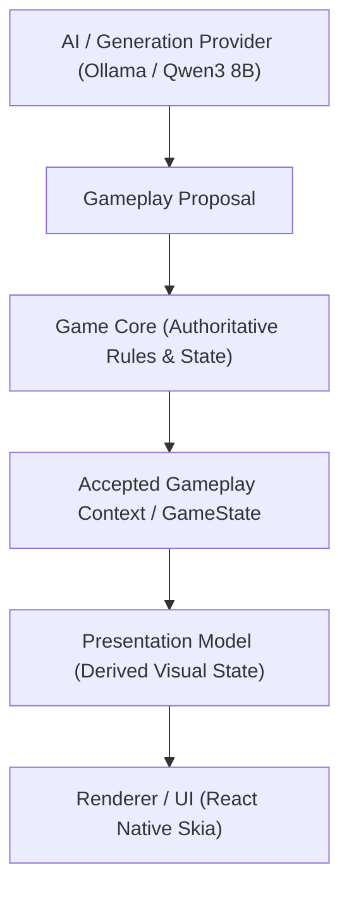

# AI Pet Game

An AI-powered virtual pet game designed for children (ages 3–9) that combines curiosity, creativity, learning, and personalized play through AI-generated gameplay experiences. Unlike traditional open-ended chatbots, the application enforces the core architectural principle of **bounded generation, not bounded selection**—allowing AI to propose novel narrative and adventure gameplay within strict boundaries defined and validated by an authoritative Game Core.

## Project Status

The repository currently contains a **playable visual vertical slice / MVP prototype** demonstrating an end-to-end AI-driven gameplay loop:

1. The application starts an anonymous session and instantiates a pet (**Lumi**).
2. Game Core maintains authoritative game state and rules independently of the UI.
3. Player interaction triggers gameplay generation via a thin Node.js HTTP runtime connecting to a local AI provider (**Ollama with Qwen3 8B**).
4. The AI returns a structured, bounded gameplay proposal.
5. Game Core validates the proposal, applying correction or fallback if rejected.
6. Accepted gameplay context is mapped into a derived **Presentation Model**.
7. A 2D game world is rendered using **React Native Skia** across Web, iOS, and Android.
8. Player exploration actions mutate authoritative state, allowing gameplay history to dynamically influence subsequent AI generation.

## Product Vision

The product vision is to deliver dynamically tailored child-friendly gameplay where AI creates genuinely distinct experiences based on:
- Pet personality and mood
- Player interaction history
- Discoveries in the game world
- Available gameplay capabilities

Rather than producing cosmetic text chat bubbles, the AI influences visual game state, world objects, and active gameplay choices while operating safely within predefined domain constraints.

## Architecture

The system enforces a unidirectional flow where AI remains an untrusted generator and Game Core remains the sole authority over game rules:



### Layer Responsibilities

- **Game Core (`packages/game-core`)**: Authoritative domain engine. Owns `GameState`, gameplay rules, capability definitions, player action transitions, proposal validation, correction/fallback mechanisms, and domain events. AI cannot directly mutate authoritative state.
- **Generation / AI Layer**: Abstracted via `GenerationProvider`. The local development setup uses `OllamaGenerationProvider` with `Qwen3 8B`. Generates bounded proposals from controlled prompt contexts.
- **Runtime (`packages/runtime`)**: Thin Express HTTP service layer. Manages anonymous in-memory sessions, injects `GenerationProvider`, and exposes REST endpoints (`/sessions`, `/generate`, `/actions`).
- **Presentation Model (`packages/ui/src/presentation`)**: Derived, non-authoritative representation of accepted gameplay. Decouples game rules from rendering technologies and allows the UI to evolve independently (including future renderers such as Unity).
- **UI & Renderer (`packages/ui`)**: Built with React Native, Expo, and React Native Skia. Renders the 2D visual meadow, animated pet, glowing world objects, and HUD controls. **iOS, Android, and Web** are all supported as first-class target platforms.

## Architecture Principles

- **Game Core is Authoritative**: State transitions and game rules are strictly deterministic.
- **AI Output is Untrusted**: All generated proposals are validated before impacting gameplay.
- **Bounded Generation**: Prompts restrict AI candidates to valid Game Core capabilities.
- **Correction & Fallback**: Invalid proposals undergo one correction attempt before defaulting to a deterministic fallback.
- **Thin Service Boundary**: The HTTP runtime contains zero game logic.
- **Framework Independence**: Game Core has no dependencies on React, Express, or HTTP.
- **Replaceable Providers**: AI models and rendering engines can be swapped without rewriting Game Core.

## Technology Stack

| Area | Technology | Version / Specification |
| --- | --- | --- |
| **Language** | TypeScript | `~7.0.2` (Game Core / Runtime), `~6.0.3` (UI) |
| **Runtime** | Node.js | ESM / NodeNext (`"type": "module"`) |
| **Domain Engine** | Game Core | `@ai-pet-game/game-core` |
| **Backend API** | Express | `^4.18.2` (`@ai-pet-game/runtime`) |
| **AI Provider** | Ollama | `OllamaGenerationProvider` |
| **Local LLM** | Qwen3 8B | `qwen3:8b` (via `http://localhost:11434`) |
| **Mobile & Web UI** | React Native | `0.86.3` / React `19.2.3` |
| **App Framework** | Expo | SDK `~57.0.25` |
| **2D Renderer** | React Native Skia | `@shopify/react-native-skia` `2.6.2` |
| **Testing** | Node Test Runner | `node --test` (native) |

## Repository Structure

```text
.
├── packages/
│   ├── game-core/        # Authoritative domain rules, capabilities, state transitions & validation
│   ├── runtime/          # Express HTTP API layer & anonymous in-memory session store
│   └── ui/               # React Native & Skia visual client for Web, iOS, and Android
├── knowledge/
│   ├── architecture/     # Technical specifications, domain boundaries & sequence models
│   └── decisions/        # Architecture Decision Records (ADR-001 through ADR-009)
├── skills/               # Developer operational guidance and workflow cheat-sheets
├── AGENTS.md             # Developer & AI agent workflow guidelines
└── README.md             # Root repository documentation (this file)
```

## Prerequisites

- **Node.js**: v20+ (with native `--test` support)
- **npm**: v9+
- **Ollama**: Running locally on `http://localhost:11434`
- **Qwen3 8B Model**: Installed via `ollama pull qwen3:8b`
- **Expo Go App** (Optional): For testing on physical iOS/Android mobile devices
- **Web Browser**: Chrome, Edge, Safari, or Firefox for Web testing

## Local Setup

Clone the repository:
```bash
git clone https://github.com/your-org/ai-pet-game.git
cd ai-pet-game
```

Install dependencies inside each package directory:
```bash
# Install Game Core dependencies
cd packages/game-core && npm install

# Install Runtime dependencies
cd ../runtime && npm install

# Install UI dependencies
cd ../ui && npm install
```

## Running the Game Core Tests

Game Core unit tests validate capability scoping, proposal validation, correction/fallback mechanics, and state transitions (111 tests):

```bash
cd packages/game-core
npm test
```

## Running the Runtime Tests

Runtime tests validate session isolation, HTTP route behavior, error code mapping, and provider injection (21 tests):

```bash
cd packages/runtime
npm test
```

## Running the UI

### Web Target

1. Ensure the Runtime server is running on port 3000 (see [Runtime / AI Setup](#runtime--ai-setup)).
2. Launch the Expo web dev server:
```bash
cd packages/ui
npm run web
```
3. Open `http://localhost:8081` in your browser.

### Mobile Target (Expo Go on iOS & Android)

1. Start Ollama and the Runtime server on your development machine.
2. Find your local network (LAN) IP address (e.g., `192.168.1.50`).
3. Launch Expo with the `EXPO_PUBLIC_RUNTIME_URL` environment variable pointing to your machine:
```bash
cd packages/ui
EXPO_PUBLIC_RUNTIME_URL=http://192.168.1.50:3000 npm start
```
4. Connect your iOS or Android phone to the same Wi-Fi network.
5. Open **Expo Go** on your device and scan the terminal QR code.

*(Note: `localhost` on a physical phone refers to the phone itself. Using `EXPO_PUBLIC_RUNTIME_URL` ensures the app targets your host development machine).*

## Runtime / AI Setup

1. Start the local Ollama instance:
```bash
ollama serve
```
2. Pull the Qwen3 8B model:
```bash
ollama pull qwen3:8b
```
3. Start the HTTP Runtime:
```bash
cd packages/runtime
npm run build
npm start
```
The server will start on `http://localhost:3000` (configurable via `PORT`, `OLLAMA_BASE_URL`, and `OLLAMA_MODEL`).

## Testing the Complete Local Flow

1. Start Ollama (`ollama serve`) and the Runtime (`cd packages/runtime && npm start`).
2. Start the UI (`cd packages/ui && npm run web`).
3. Observe **Lumi** floating in the 2D Skia meadow alongside the glowing **Blue Stone**.
4. Click **✨ AI Channel Magic** or tap the stone.
5. Observe the runtime query Ollama, validate the proposal in Game Core, and update the active narrative card and stone discovery status.
6. Click **🔍 Explore Stone** to send an authoritative action, updating Lumi's mood and interaction counters.

## API / Runtime Overview

| Method | Endpoint | Description |
| --- | --- | --- |
| `POST` | `/sessions` | Creates a new anonymous in-memory game session (optional `{ petName }`). |
| `GET` | `/sessions/:sessionId/state` | Retrieves the current authoritative `GameState`. |
| `POST` | `/sessions/:sessionId/generate` | Requests an AI-generated gameplay proposal validated by Game Core. |
| `POST` | `/sessions/:sessionId/actions` | Submits a player action (`observe`, `explore`, `greet_pet`, `ask_pet_question`). |

## Documentation Index

### Architecture Specifications (`knowledge/architecture/`)

- [`ai-game-core-generative-contract.md`](knowledge/architecture/ai-game-core-generative-contract.md): Generative provider and Game Core contract specification.
- [`application-layer-and-use-cases.md`](knowledge/architecture/application-layer-and-use-cases.md): Application service boundaries and use case flows.
- [`capability-model.md`](knowledge/architecture/capability-model.md): Scoped capability model for bounded generation.
- [`controlled-generation-context.md`](knowledge/architecture/controlled-generation-context.md): Context building specification for prompt generation.
- [`domain-events-and-state-flow.md`](knowledge/architecture/domain-events-and-state-flow.md): Event-driven state transitions and lifecycle.
- [`game-core-domain-boundaries.md`](knowledge/architecture/game-core-domain-boundaries.md): Bounded contexts and domain boundary definitions.
- [`gameplay-proposal-model.md`](knowledge/architecture/gameplay-proposal-model.md): Gameplay proposal schemas and validation rules.
- [`generated-gameplay-context-and-state.md`](knowledge/architecture/generated-gameplay-context-and-state.md): Translating accepted proposals into game state.
- [`generated-sequence-and-player-actions.md`](knowledge/architecture/generated-sequence-and-player-actions.md): Interaction sequences and action dispatch.
- [`generative-capability-space.md`](knowledge/architecture/generative-capability-space.md): Generative capability taxonomy.
- [`mini-mvp-runtime.md`](knowledge/architecture/mini-mvp-runtime.md): Anonymous in-memory runtime specification.
- [`runtime-and-deployment-overview.md`](knowledge/architecture/runtime-and-deployment-overview.md): Runtime infrastructure strategy.
- [`system-overview.md`](knowledge/architecture/system-overview.md): High-level architectural overview.
- [`typescript-and-tooling-conventions.md`](knowledge/architecture/typescript-and-tooling-conventions.md): Code conventions and compiler settings.
- [`visual-runtime.md`](knowledge/architecture/visual-runtime.md): Renderer decoupling and presentation architecture.

### Architecture Decision Records (`knowledge/decisions/`)

- [`ADR-001-game-core-authority.md`](knowledge/decisions/ADR-001-game-core-authority.md): Game Core is the authoritative source of game state and rules.
- [`ADR-002-ai-bounded-narrative-engine.md`](knowledge/decisions/ADR-002-ai-bounded-narrative-engine.md): AI is a bounded narrative and creative engine.
- [`ADR-003-game-core-framework-independence.md`](knowledge/decisions/ADR-003-game-core-framework-independence.md): Game Core must remain independent of the UI framework.
- [`ADR-004-postgresql-neon-for-persistence.md`](knowledge/decisions/ADR-004-postgresql-neon-for-persistence.md): PostgreSQL with Neon for persistence (future baseline).
- [`ADR-005-cloudflare-workers-backend-runtime.md`](knowledge/decisions/ADR-005-cloudflare-workers-backend-runtime.md): Cloudflare Workers as Backend Runtime (future baseline).
- [`ADR-006-ai-game-core-contract.md`](knowledge/decisions/ADR-006-ai-game-core-contract.md): AI and Game Core communicate through a controlled proposal contract.
- [`ADR-007-ai-driven-player-experience.md`](knowledge/decisions/ADR-007-ai-driven-player-experience.md): AI-Driven Player Experience Through Bounded Generation.
- [`ADR-008-provider-agnostic-ai-model-capabilities.md`](knowledge/decisions/ADR-008-provider-agnostic-ai-model-capabilities.md): Provider-Agnostic AI Model Capabilities.
- [`ADR-009-mvp-runtime-and-anonymous-sessions.md`](knowledge/decisions/ADR-009-mvp-runtime-and-anonymous-sessions.md): MVP Runtime and Anonymous In-Memory Game Sessions.

## Current Limitations & MVP Scope

- **In-Memory Anonymous Sessions**: Game sessions do not persist across runtime restarts.
- **Local AI Dependency**: Proposal generation relies on a local Ollama instance running Qwen3 8B.
- **Vertical Slice Scope**: Features focus on the core pet interaction, blue-stone discovery, and proposal generation loop.
- **2D Skia Renderer**: The UI current renders a 2D meadow scene; future renderers (e.g. 3D/Unity) can hook into the existing Presentation Model.

## Roadmap & Future Direction

Development proceeds iteratively through vertical slices. Future milestones will extend the established Game Core foundation to introduce:
1. Persistent user and pet accounts (PostgreSQL / Neon).
2. Serverless cloud runtime deployment (Cloudflare Workers).
3. Expanded generative capability spaces and multi-environment worlds.
4. Richer pet customization and mini-game integrations.

## Contributing & Package Organization

- **Domain Rules**: Edit `packages/game-core` to introduce new capabilities, state transitions, or validation logic.
- **Service API**: Edit `packages/runtime` to modify HTTP routes or AI provider bindings.
- **Client Presentation**: Edit `packages/ui` for presentation mapping, Skia canvas graphics, or screen layouts.
